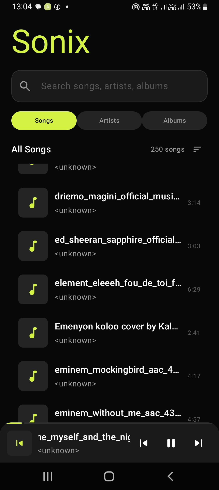
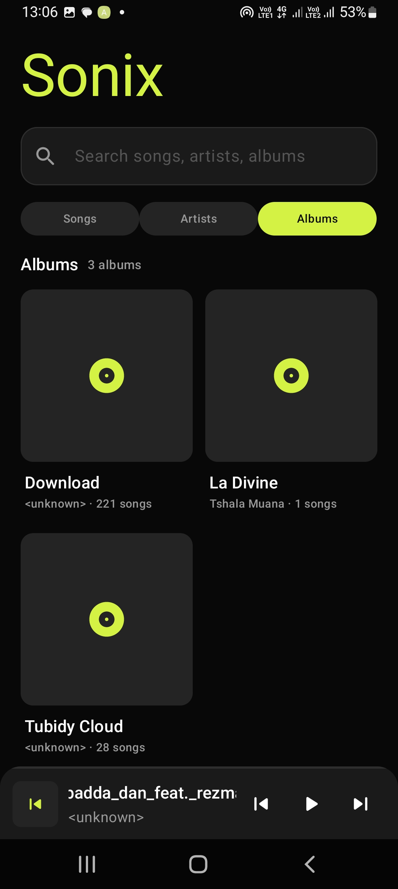
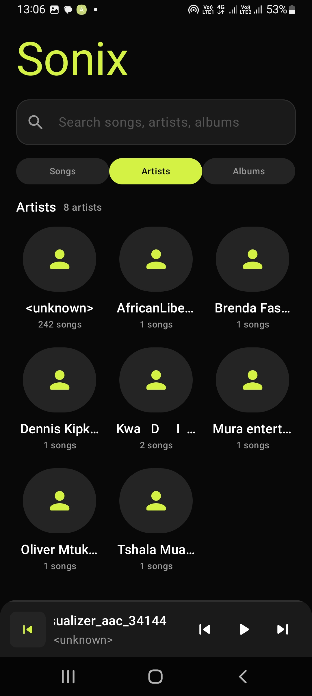
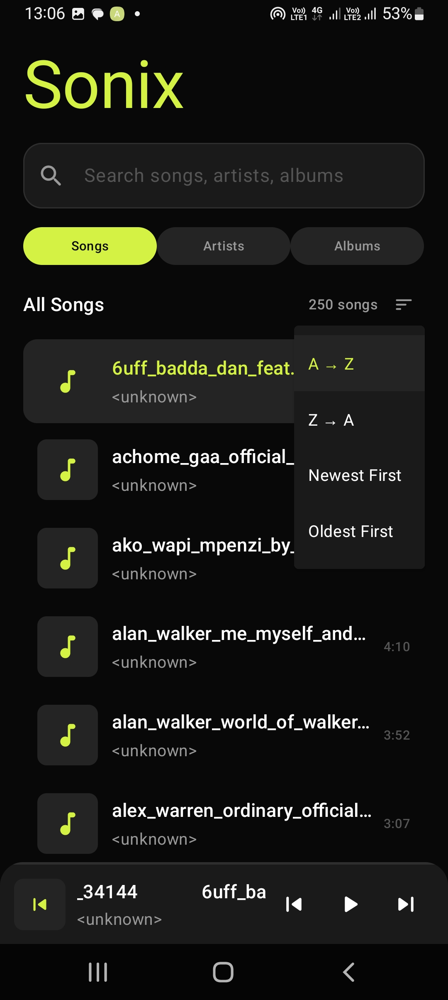

# Sonix 🎵

Modern offline music player built with Kotlin and Jetpack Compose.

---

## Features
- Offline music playback
- Albums & Artists
- Song ordering
- Mini player
- MVVM architecture

---

## Screenshots

  
  
  

  
  
  

---

## Tech Stack
- Kotlin
- Jetpack Compose
- Room Database
- MediaStore API

---

## Author
Nick Cheruiyot